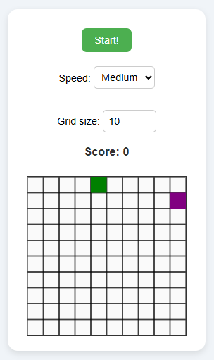

# 🐍 Snake_JS
A simple Snake game made using HTML, CSS, and vanilla JavaScript.

## 🗒️ Features
- Customizable grid size
- Keyboard controls (Arrow keys and ZQSD)
- Adjustable game speed
- Score tracking

## 📷 Screenshot

## How to Run

▶️ **Play directly on CodePen:**  
[https://codepen.io/Witchoy/pen/KwpPxgp](https://codepen.io/Witchoy/pen/KwpPxgp)

**OR**

1. Clone the repository:  
   `git clone https://github.com/Witchoy/Snake_JS.git`

2. Open `game/index.html` in your favorite web browser.

3. Enjoy the game!

## Author
[Jules Goy](https://github.com/Witchoy)
